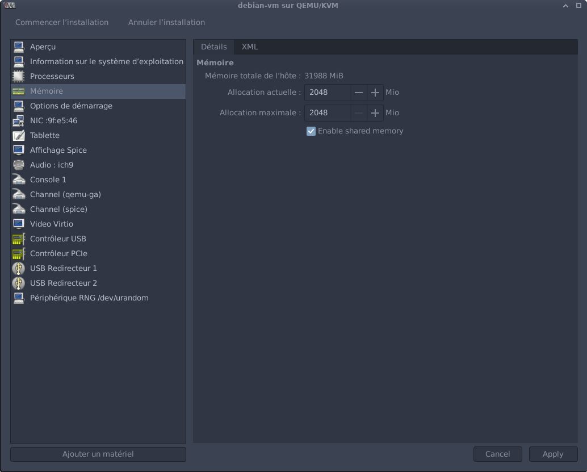

# How to make a Diskless Virtual Machine (KVM)

## What this is about

Virtual machines usually require a virtual disk to store data.
With KVM/Qemu, and Virtiofs, it is possible to boot a Linux virtual machine directly in a Virtiofs (shared folder) root.
This process bypasses the usual bootloader step (grub is not used here), and boots the kernel directly with its initramfs. The virtiofs root is described in the kernel parameters.

## Motivations

Virtual disks are usually very inefficient if not managed carefully. This is especially true in data centers, where administrators can only compress existing data and not properly inspect removed files.
However, this also affects consumer machines, since virtual machines need more space over time, due to VM upgrades and having excess virtual free space to avoid manual resizing.


The main source of waste is removing files on mostly empty dynamic virtual disks. Removing files does not remove the data written on the virtual disk, which means all file replacements (e.g. system upgrades) and deletions (e.g. temporary files, downloaded archives) will make the physical space useage increase over time.
Optimizing this space is also not possible with standard virtual disk optimization tools:
- `virt-sparsify`, by Red Hat, can optimize Qcow2 virtual disks, but is very slow and needs a lot of free disk space to operate
- [`disk-replicator`](https://github.com/yacinecheikh/disk-replicator), which i wrote myself, can also optimize Qcow2 disks with much less space by generating an identical copy from scratch, but optimizing disks still takes a lot of time for larger disks.
- other optimization tools (VMWare, Hyper-V, qemu-img -c) work by compressing existing data witout removing waste, which is a temporary fix until the guest OS starts writing new files, and also does not remove waste.


A common solution to this problem is containers. However, containers do not offer as much isolation as virtual machines, and cannot be used for malware testing for example.
Being able to share a host filesystem with a guest OS while emulating the hardware will hopefully help close the gap between containers and virtual machines.


After this tutorial, you will never have to manage virtual disks again.


## Shortcomings

Virtual machines created this way will share the same filesystem limit as the host system (and other virtual machines running on virtiofs root filesystems).

To implement size limits, it is possible to use quotas on btrfs or zfs subvolumes, by creating a subvolume for the virtual machine root folder. Doing so will also allow taking snapshots of the guest filesystem on btrfs.


Performance can also be a problem.
I have not benchmarked virtiofs compared to qcow2 virtual disks, but I think virtiofs has been a bit slower than accessing a filesystem inside a virtual disk on my own machine.


Moreover, sharing the filesystem means losing the ability to compress the virtual disk. This, however, can be replaced by compression at the filesystem level, with btrfs subvolumes for example. Filesystem level compression also requires less maintenance, since files are transparently compressed, whereas virtual disks lose their compression over time (as new uncompressed files are written by the VM).


## Bugs

I have not been able to get a reproducible setup for the qemu guest agent (and spice-vdagent, needed for the copy paste clipboard to be shared with the host)

## Requirements for this example

- virt-manager (for the graphical configurations)
- debian (I will be using debootstrap to create the guest OS, but most other distros can be used)
- chroot creation utilities:
    - arch-install-scripts
    - debootstrap

On debian, you can install virt-manager (and the libvirt/Qemu/KVM stack) with:
```sh
sudo apt install virt-manager
sudo adduser $USER libvirt  # allow current user to manage virtual machines
sudo virsh net-autostart --network default  # start the default VM NAT network at boot
sudo virsh net-start --network default  # start the network manually (or reboot)
```
You can then start virt-manager and use KVM virtual machines.


Other dependencies can be installed with:
```sh
sudo apt install arch-install-scripts
sudo apt install debootstrap
```
Debootstrap is the official Debian bootstrapping tool, used to create a Debian environment in a directory.
The Arch install scripts are helper tools developed by the Arch Linux community, and used in the [Arch installation guide](https://wiki.archlinux.org/title/Installation_guide). I will be using arch-chroot, a wrapper over chroot to help running system commands from within the chroot.


## Building the VM

For this tutorial, I will use commands that match the graphical Debian installer as closely as possible, using this [Arch install guile equivalent for Debian](https://github.com/yacinecheikh/debootstrap) (in French). I will skip the detailed explanations here.

Unlike other Linux installations, we will not use any partitioning software. Everything will be contained in a simple folder:
```sh
mkdir debian-vm
```

With btrfs, I can create a subvolume with:
```sh
sudo btrfs subvolume create debian-vm
```

### Debian install

The debootstrap syntax is simple:
```sh
debootstrap <debian release> <target>
```

I will also include the SSL certificate authorities to avoid using HTTP to fetch packages with apt:
```sh
sudo debootstrap --include=ca-certificates stable debian-vm
```

### System configurations

#### Apt repositories
Replace `debian-vm/etc/apt/sources.list` with:
```
#deb http://deb.debian.org/debian stable main
deb https://deb.debian.org/debian/ stable main contrib non-free-firmware
deb-src https://deb.debian.org/debian/ stable main contrib non-free-firmware

deb https://security.debian.org/debian-security stable-security main contrib non-free-firmware
deb-src https://security.debian.org/debian-security stable-security main contrib non-free-firmware

deb https://deb.debian.org/debian stable-updates main contrib non-free-firmware
deb-src https://deb.debian.org/debian stable-updates main contrib non-free-firmware
```

#### Fstab
Replace `debian-vm/etc/fstab` with:
```
fs	/	virtiofs	defaults	0	0
```
`fs` is the name I will use for the virtiofs shared folder. You can use a different name, but it has to be consistent with the VM settings.

#### Hostname

Edit `debian-vm/etc/hostname` and set the hostname for the VM


### Chrooting into the system

```sh
LANG=C.UTF-8 sudo arch-chroot debian-vm
```

The rest of the VM setup will happen inside the chroot.

### Essential packages

```sh
apt install linux-image-amd64 firmware-linux network-manager sudo
```

### Adding virtiofs to the initramfs

```sh
echo "virtiofs" >> /etc/initramfs-tools/modules
# update the initramfs
update-initramfs -u
```

### Users

Non-interactive:
```sh
adduser --disabled-password --comment "" <user>
# disable the user password
passwd -d <user>
adduser <user> sudo
```

Interactive:
```sh
adduser <user>
adduser <user> sudo
```

### Timezone

```sh
dpkg-reconfigure tzdata
```

### Locales

```sh
apt install locales
dpkg-reconfigure locales
```

### Console

This step will prompt you for the system keyboard layout (not the same as the layout in the GUI, that one is managed by X11 or Wayland):
```sh
apt install console-setup
```

### Additional packages
These packages are not strictly needed for Debian to work, but they are included in the graphical installer and are very convenient to have.
```sh
apt install bash-completion command-not-found
# command-not-found needs the apt cache to be refreshed
apt update
```

### Graphical interface

If you need a desktop environment:
```sh
tasksel --list
# Examples:
# tasksel install xfce-desktop
# tasksel install kde-desktop
# tasksel install gnome-desktop
```


## Virt-manager setup

On Virt-manager, open the VM creation menu, and choose "Manual installation":


On the storage screen, disable the storage for this VM:


On the last screen, enable the Customize option:


Then, in the Memory panel, enable shared memory:


In boot options, add the direct kernel boot parameters:

On Debian, the kernel is stored at `/vmlinuz` and the initramfs is at `/initrd.img`.

Add a new filesystem:


Click on Install to start the VM.


